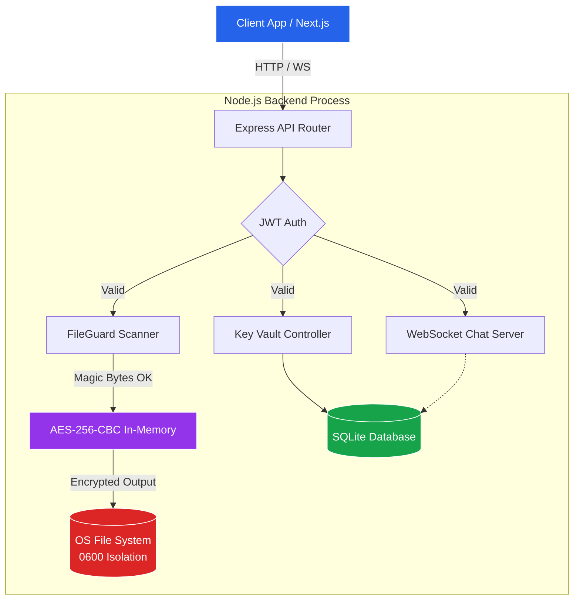

# VaultLock: Secure File Encryption & Decryption Tool


## Project Overview
VaultLock is a comprehensive demonstration of **Operating System-level data protection, advanced cryptographic security, and real-time safe communication**. This system ensures that sensitive files are encrypted, stored securely, and completely scrubbed upon deletion. It enforces strong memory-level zero-knowledge operations where plain data never touches the disk. 

The project has evolved from Phase 1 (Encryption only) to a fully-featured secure workspace encompassing Secure File Drive, an End-to-End Chat system, and a robust Password / Secrets Vault.

## System Architecture



## Key Features

### Core Cryptography

- **AES-256-CBC Encryption**: In-memory streaming encryption utilizing Node's built-in `crypto` APIs.
- **Zero-Knowledge Architecture**: Plaintext is never written to disk. The server never persists your keys; decryption keys are single-use or handled client-side/via memory.
- **Data Integrity**: SHA-256 digesting to guarantee files haven't been tampered with or corrupted on disk.
- **Secure File Deletion**: 3-pass overwrite mechanism (Random → Zero → Random) with hardware `fsync()` flushing before OS unlinking, protecting against basic data recovery (Gutmann method inspired).

### The Secure Drive
- **Magic-Byte Defense**: Multi-tier file validation mechanism that identifies internal structure, completely blocking arbitrary executables (PE, ELF, Mach-O) even if extensions are spoofed.
- **OS-Level Isolation**: Hardened file access. Encrypted files are stored on disk with `0600` permissions inside per-user `0700` directories.

### Secure Real-Time Chat & Vault
- **WebSocket E2EE-Ready Chat**: Private real-time messaging verified via JSON Web Tokens middleware.
- **Personal Key Vault**: Secure repository within the SQLite Database holding AES-256 encrypted labels, tokens, or plaintext credentials.

### Audit & Reliability 
- **Centralized Audit Logging**: A chronological `audit.log` (JSON-lines) records authentication lifecycles, unauthorized access attempts, and encryptions/decryptions.
- **Rate Limiting**: Defends global API boundaries and throttles heavy cryptographic procedures (IP-based limits).

---

## Technical Stack
- **Backend**: Node.js, Express, `node:sqlite` (synchronous built-in db), `jsonwebtoken`, WebSockets (`ws`).
- **Frontend V1**: Vanilla HTML, CSS, JS workspace.
- **Frontend V2 (Next.js)**: Modern responsive React frontend built with Next.js, Framer Motion, and TailwindCSS (in `frontend-next/`).

---

## Applied OS Principles
| Principle | Implementation in VaultLock |
|----------|------------------|
| **Secure I/O** | Direct memory processing of streams before storage. |
| **Process Isolation** | API isolated in a Node process using JWT authorization. |
| **Memory Protection** | Keys and payload live temporarily in RAM; garbage collected post-request. |
| **File System Security** | `0600` mapping strictly limits file descriptor visibility to the server owner. |
| **Least Privilege** | Unauthorised reads are blocked at route-middleware, before touching IO layers. |

---

## Getting Started

### Prerequisites
- Node.js v20+ or v22/v25 (Requires `node:sqlite` feature).
- NPM or PNPM

### Installation

1. **Clone & Setup Environment**
   ```bash
   git clone <repo_url>
   cd os_project/backend
   cp .env.example .env  
   ```

2. **Start Backend Server**
   ```bash
   cd backend
   npm install
   npm start
   ```

3. **Start Frontend (Next.js)**
   ```bash
   cd frontend-next
   npm install
   npm run dev 
   ```

*(Alternatively, for testing Phase 1/V1, you can run a Python HTTP Server in the `frontend/` directory).*

---

## API Structure Overview

- `POST /auth/register` : Create a secure context user
- `POST /auth/login` : Issue JWT bearer tokens
- `POST /encrypt` : Encrypt inbound `multipart/form-data` and retain in drive.
- `POST /decrypt` : Return original bytes of a provided `.enc` object.
- `POST /secure-delete` : Overwrite and unlink encrypted blobs from the system.
- `WS /` : WebSocket upgrade point.

---

## Future Enhancements
1. **End-to-End Encryption (E2EE)**: Pushing AES-GCM encryption completely to the browser/client in `frontend-next`.
2. **Chunking for Large Files**: Replacing bounded buffers with generic Streams for >500MB capabilities. 
3. **Hardware Key Modules**: FIDO2 proxy routing.

*VaultLock is an ongoing demonstration of theoretical OS design scaled into a practical Node.js environment.*
